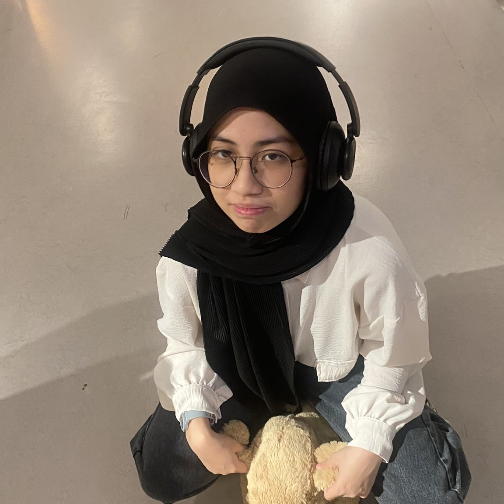

# ✨ MY CUTIE: NASHWA ✨


*The cutest smile in the universe* 💖

.png>)
*bwt u 
## 🌟 WHO IS NASHWA? 🌟

Nashwa isn't just a person - she's a whole **VIBE**! Let me tell you all about this amazing human who makes my heart do the thing™️

## 💝 Quick Facts 💝

| Category | The Nashwa Effect |
|----------|-------------------|
| **Smile Level** | ☀️☀️☀️☀️☀️ (Literally blinds me) |
| **Cuteness Factor** | ∞/10 (Scientists are still studying this phenomenon) |
| **Laugh** | Can cure sadness in a 10-mile radius |
| **Style** | Effortlessly cool with a hint of adorable |
| **Special Power** | Making my day better just by existing |

## 🦋 Things That Make Nashwa Nashwa 🦋

### 😊 Her Adorable Habits
* The way she scrunches her nose when she laughs
* How she gets super excited about the smallest things
* That little dance she does when she's happy
* The way she says my name when she's sleepy
* Her focused face when she's working on something important

### 🌈 What Makes Her Special
* **Kindness**: Makes everyone feel important
* **Intelligence**: Always has the most interesting thoughts
* **Humor**: Has me laughing until my stomach hurts
* **Creativity**: Sees the world in colors I didn't know existed
* **Strength**: Handles challenges with amazing grace

### 💭 Things She Says That Melt Me
> "Are you hungry? I made something for you!"

> "Look at this cute thing I found!"

> "I was thinking about you today when..."

> "Can we please get ice cream?"

> "You make me so happy"

## 📱 Nashwa's Favorite Things 📱

### 🎵 Songs That Make Her Dance
1. [Her ultimate favorite song]
2. [That one she always puts on repeat]
3. [The one that makes her sing at the top of her lungs]

### 🍕 Foods That Make Her Go "Mmmmm!"
- That one specific dish from that specific restaurant
- Anything chocolate-related (especially at midnight)
- That weird food combination that somehow works?
- Ice cream (specifically when sharing is NOT required)

### 📺 Shows She Can Rewatch Forever
* That one series she knows every line from
* The comfort show she puts on when she's sad
* The documentary series that blew her mind

## 🎁 The Nashwa Dictionary 🎁

| Nashwa-ism | Translation |
|------------|-------------|
| "I'm not hungry" | Will steal food off your plate in 5 minutes |
| "Just one more episode" | We're not sleeping tonight |
| "I'll be ready in 5 minutes" | Minimum 30 minutes, but worth the wait |
| "Whatever you want" | There is definitely a right answer and it's not whatever |
| "Nothing's wrong" | Something specific is wrong and you should know what |

## 💫 Why She's My Favorite Person 💫

Let me count the ways:

1. **Her heart** - so big it has room for everyone
2. **Her mind** - full of the most fascinating thoughts
3. **Her soul** - the most beautiful I've ever known
4. **Her support** - always there when I need her
5. **Her dreams** - which I'm honored to be part of

## 🌙 Our Story 🌙

Once upon a time, the universe decided I deserved something wonderful, and there she was - Nashwa. From [how we met] to [special memory] to right now, every chapter has been better than the last.

### ⏰ Timeline of Cuteness ⏰
* **First meeting**: My life changed forever
* **First date**: I knew she was special
* **First laugh together**: I was completely done for
* **First [special moment]**: No turning back

## 📸 Nashwa Being Nashwa: A Gallery 📸

*(Imagine the cutest collection of moments here)*

## 🎮 Nashwa's Character Stats 🎮

```
NASHWA v1.0
-----------
❤️ LOVE       [####################] 100%
✨ CUTENESS   [####################] 100%
🧠 WISDOM     [##################__]  90%
🔥 PASSION    [####################] 100%
🦄 UNIQUENESS [#####################] 110% (OVERFLOW!)
```

## 📝 Things I Want To Do With Nashwa 📝

- [ ] Travel to that place she always talks about
- [ ] Try that food she's been curious about
- [ ] Dance in the rain together
- [ ] Build that project we keep talking about
- [ ] Grow old and still make each other laugh

## 🌠 Dear Nashwa 🌠

Thank you for being you. Thank you for your smile, your laugh, your heart. Thank you for choosing me. Every day with you is my favorite day.

With all the love in the universe,
[Your Name] 💖

---

*This document is scientifically accurate and peer-reviewed by the International Association of People Who Think Nashwa Is Amazing (membership: everyone who has met her).*